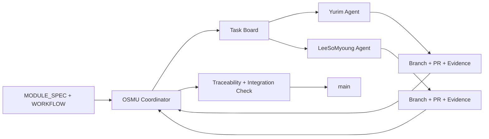

# 에이전트 협업 구조

## 역할

### OSMU Coordinator

Planner, Dispatcher, Integrator 역할을 맡는다. 코드를 대신 구현하는 제3 작업자가 아니라 기준 문서, 작업 보드, PR, 검사 증거를 대조하는 관리자다.

- Planner: MODULE_SPEC 요구사항을 원자화하고 작업·검사와 연결한다.
- Dispatcher: 의존성, 파일 소유권, 각 작업자 에이전트의 안전 할당량을 보고 다음 작업을 제안한다.
- Integrator: PR의 요구사항 연결과 증거를 확인하고 `verified` 여부를 판정한다.

### Worker Yurim / Worker LeeSoMyoung

각 사람은 자신의 Codex 작업, Codespace 또는 로컬 worktree와 별도 브랜치를 사용한다. 작업자는 맡은 작업의 구현, 검사, 증거, 상태 갱신까지 책임진다.

## 흐름

## 브랜치와 파일 소유권

- 브랜치: `agent/<worker>/<task-id>-<short-name>`
- 한 작업의 `allowed_paths`는 동시에 한 작업자만 수정한다.
- 공용 계약, DB migration, 기준 명세는 관리자 검토가 필요한 `shared_paths`다.
- 다른 작업의 소유 파일이 필요하면 직접 수정하지 않고 작업 보드에 변경 요청을 남긴다.

## 상태 전이

`planned → ready → claimed → working → pr → review → verified → done`

보조 상태는 `blocked`, `decision_required`, `cancelled`다. `verified`는 PR, 검사, 증거, 요구사항 연결이 모두 확인됐다는 뜻이다. `done`은 검증된 변경이 `main`에 병합되고 기준 브랜치에서 다시 검사된 뒤에만 사용한다.
